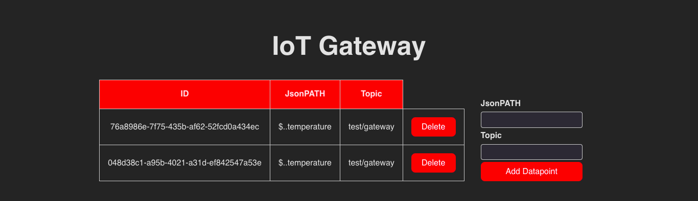
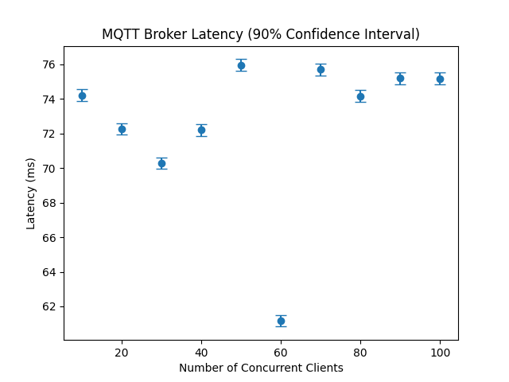
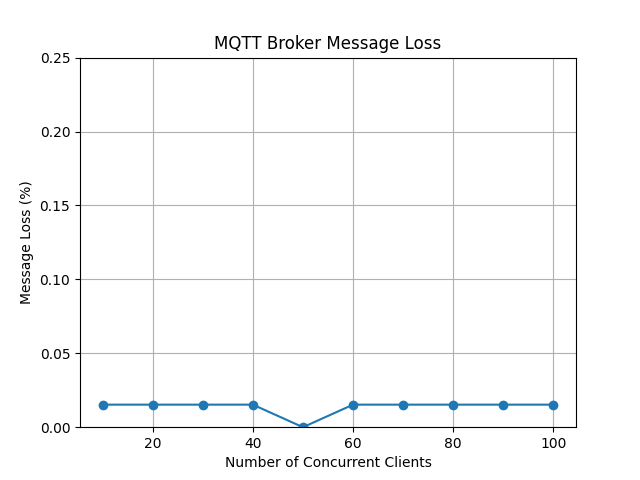
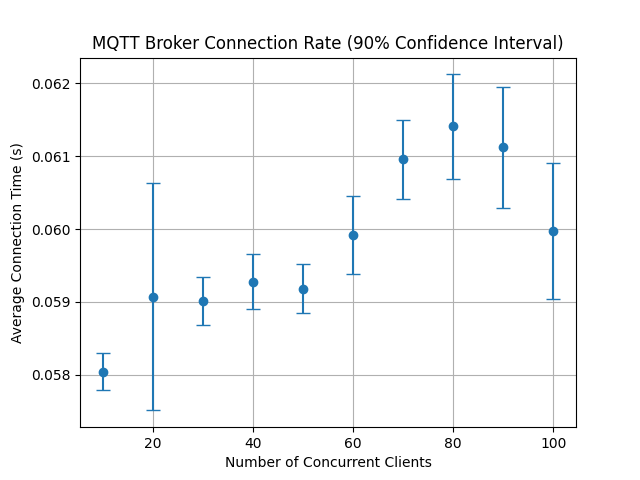

# MQTT Gateway

## Overview
This is a universal MQTT gateway for the NGSI-V2 Context broker. It can support any MQTT-based sensor data communication using JSON as the payload. It acts as a software-based IoT Gateway that helps manage heterogeneous field devices. The gateway is implemented in Python and uses the [FastAPI](https://fastapi.tiangolo.com/) framework for a RESTful-API. A web-UI is also provided based on [Svelte](https://svelte.dev/).


## Installation
### Environment 
The docker-compose.yml used for testing is
```yaml
version: '3.8'
services:
  orion:
    image: fiware/orion:3.8.1
    hostname: orion
    container_name: fiware-orion
    depends_on:
      - mongo-db
    networks:
      - default
    expose:
      - "1026"
    ports:
      - "1026:1026"
    command: -dbhost mongo-db
    healthcheck:
      test: curl --fail -s http://localhost:1026/version || exit 1
      interval: 30s
      timeout: 30s
      retries: 3

  mongo-db:
    image: mongo:4.4
    hostname: mongo-db
    container_name: fiware-mongo-db
    expose:
      - "27017"
    networks:
      - default
    ports:
      - "27017:27017"
    command: --nojournal
    healthcheck:
      test: echo 'db.runCommand("ping").ok' | mongo localhost:27017/test --quiet
      interval: 30s
      timeout: 30s
      retries: 3

  postgres:
    image: postgres:15.2
    hostname: postgres
    container_name: fiware-postgres
    expose:
      - "5432"
    networks:
      - default
    ports:
      - "5432:5432"
    environment:
      - POSTGRES_DB=iot_devices
      - POSTGRES_USER=karelia
      - POSTGRES_PASSWORD=postgres
    healthcheck:
      test: pg_isready -U orion -d orion -h localhost
      interval: 30s
      timeout: 30s
      retries: 3
    volumes:
      - /postgres-data:/var/lib/postgresql/data

  pgadmin:
    image: dpage/pgadmin4:7.1
    hostname: pgadmin
    container_name: fiware-pgadmin
    expose:
      - "80"
    networks:
      - default
    ports:
      - "8080:80"
    environment:
      - PGADMIN_DEFAULT_EMAIL=karelia@postgres.com
      - PGADMIN_DEFAULT_PASSWORD=pgadmin
    depends_on:
      - postgres
    healthcheck:
      test: curl --fail -s http://localhost:8080 || exit 1
      interval: 30s
      timeout: 30s
      retries: 3

  redis:
    image: redis:7.0
    hostname: redis
    container_name: fiware-redis
    expose:
      - "6379"
    networks:
      - default
    ports:
      - "6379:6379"
    healthcheck:
      test: redis-cli ping
      interval: 30s
      timeout: 30s
      retries: 3

  mosquitto:
    image: eclipse-mosquitto:2.0.14
    hostname: mosquitto
    container_name: fiware-mosquitto
    expose:
      - "1883"
    networks:
      - default
    ports:
      - "1883:1883"
    healthcheck:
      test: mosquitto_sub -h localhost -t test -C 1
      interval: 30s
      timeout: 30s
      retries: 3
    volumes:
      - $HOME/.config/mosquitto/mosquitto.conf:/mosquitto/config/mosquitto.conf

networks:
  default:
    external: true
    name: bachelor_project

volumes:
  crate:
```

## Usage
### Docker
The repository contains a docker-compose.yml file that can be used to start the gateway and all the necessary services. The gateway can be started with the following command:
```bash
docker-compose build && docker-compose up -d
```

### Environment variables
The gateway can be configured with the following environment variables:
- `ORION_URL` - the URL of the Orion Context Broker
- `MQTT_HOST` - the hostname of the MQTT broker
- `MQTT_PORT` - the port of the MQTT broker
- `POSTGRES_HOST` - the hostname of the PostgreSQL database
- `POSTGRES_USER` - the username for the PostgreSQL database
- `POSTGRES_PASSWORD` - the password for the PostgreSQL database
- `POSTGRES_DB` - the name of the PostgreSQL database
- `REDIS_URL` - the URL of the Redis database (used for caching)
- `FIWARE_SERVICE` - the FIWARE service name
- `FIWARE_SERVICEPATH` - the FIWARE service path
- `API_KEY` - the API key for the gateway


## Preview



### Baseline gateway (no gateway)
#### Latency


#### Message loss


#### Connection rate

