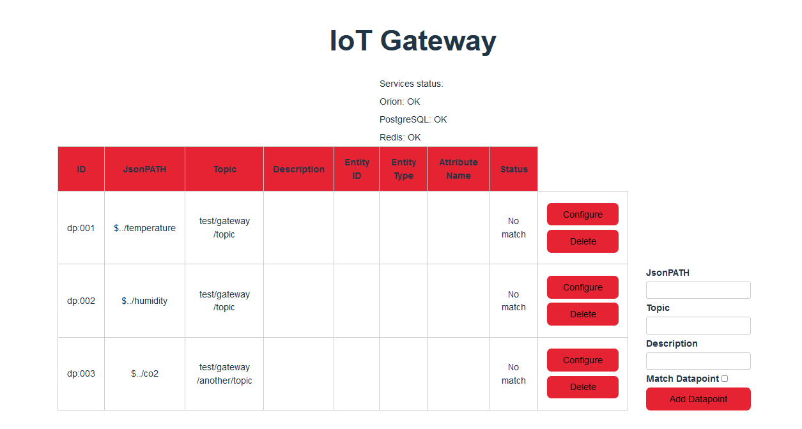
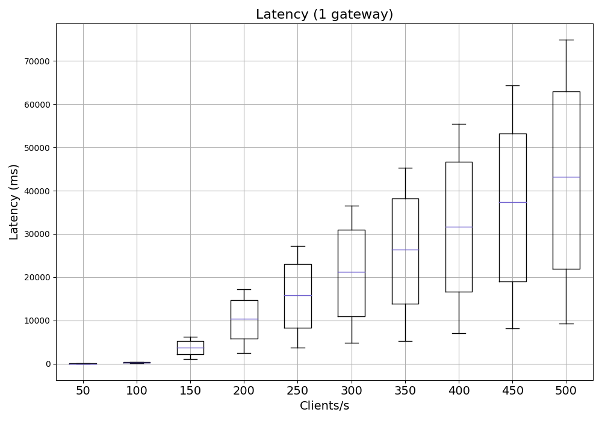
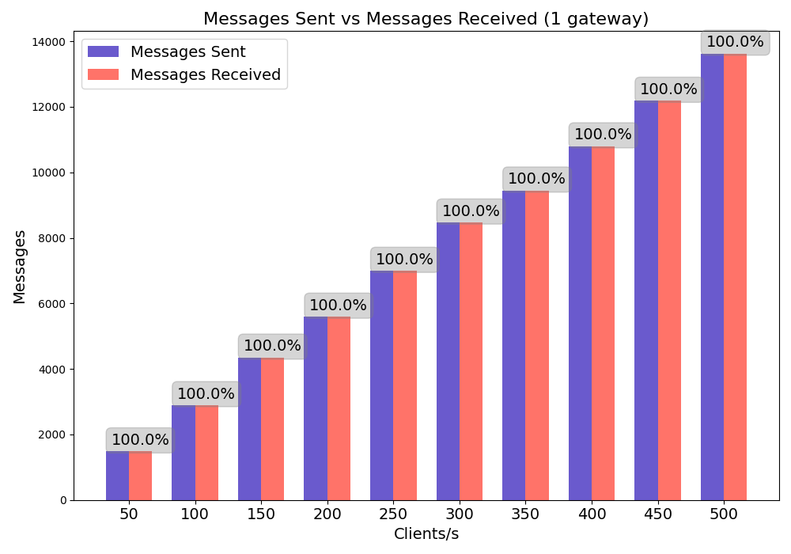
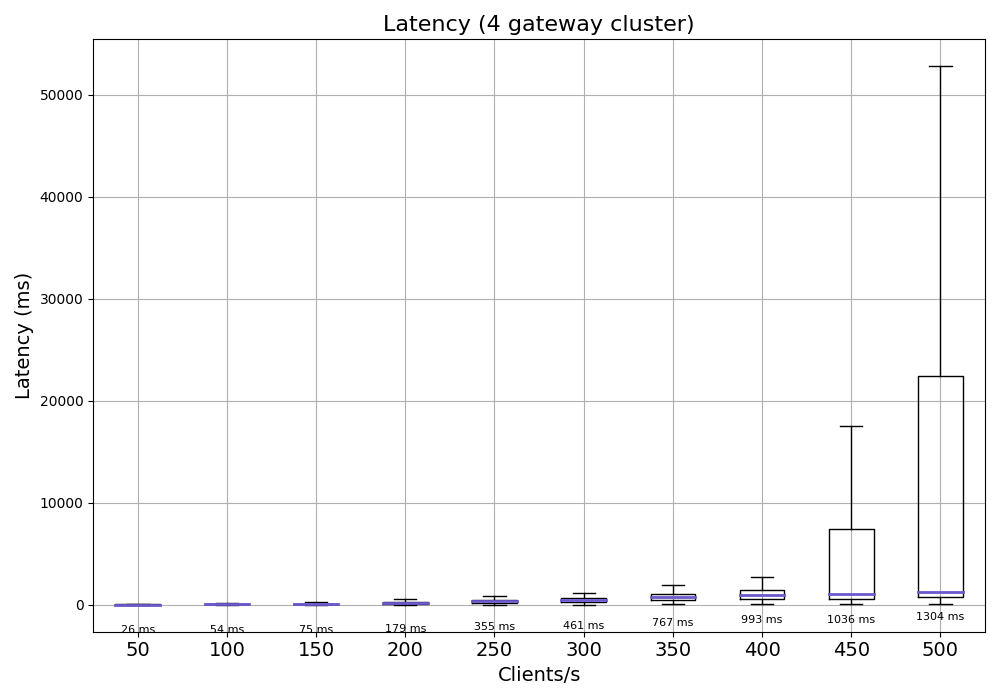
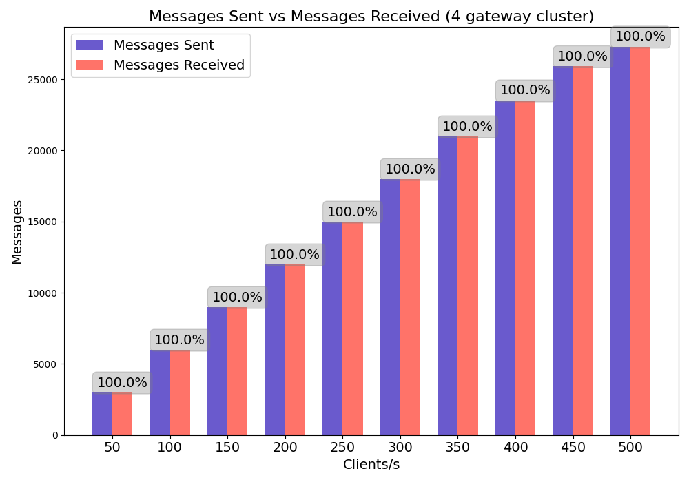

# MQTT Gateway

## Overview
This is a universal MQTT gateway for the NGSI-V2 context broker. It can support any MQTT-based sensor data communication using JSON as the payload. It acts as a software-based IoT Gateway that helps manage heterogeneous field devices. The gateway is implemented in Python and uses the [FastAPI](https://fastapi.tiangolo.com/) framework for a RESTful-API. A web-UI is also provided based on [Svelte](https://svelte.dev/).


## Quickstart
Clone the repository to your local environment.
```bash
git clone https://github.com/N5GEH/n5geh.tools.mqtt-gateway.git
cd n5geh.tools.mqtt-gateway/
```


### Requirement
The MQTT gateway acts as a southbound interface of the NGSI-V2 context broker.
Its operation requires an MVP FIWARE platform with at least two components:
- NGSI-V2 Context Broker (and its database)
- MQTT Broker

If you are new to the FIWARE platform, it is highly recommended to start with the [platform tutorials](https://github.com/N5GEH/n5geh.platform).
Otherwise, a `docker-compose.yml` is also provided in this repo.
Set up this MVP FIWARE platform with:
```bash
cd fiware-environment
docker compose pull
docker compose up -d
```
Please only use this platform setup for testing purposes.

### Deployment
Before deploying the gateway via docker containers, the environment variables need to be configured in `.env` data.
This can be created from a copy of the `env.EXAMPLE`.
The default values can be directly used for the test deployment.  
Check [here](https://github.com/N5GEH/n5geh.tools.mqtt-gateway#environment-variables) for more information about the environment variables

#### Pull docker image
Coming soon

#### Build your own docker image
The repository contains a `docker-compose.yml` file that can be used to start the gateway and all the necessary services.
The gateway can be started with the following command:
```bash
cd n5geh.tools.mqtt-gateway/
docker compose build
docker compose up -d
```

### API interaction
After deploying the gateway, you can access a swagger API specification under the end point `/docs`.
For example, if the gateway is deployed locally, then you can access the swagger ui through [localhost:8000/docs](http://localhost:8000/docs)

### Environment variables
The gateway can be configured with the following environment variables:
- `ORION_URL` - the URL of the Orion Context Broker
- `MQTT_HOST` - the hostname of the MQTT broker
- `MQTT_PORT` - the port of the MQTT broker
- `POSTGRES_HOST` - the hostname of the PostgreSQL database
- `POSTGRES_USER` - the username for the PostgreSQL database
- `POSTGRES_PASSWORD` - the password for the PostgreSQL database
- `POSTGRES_DB` - the name of the PostgreSQL database
- `REDIS_URL` - the URL of the Redis database (used for caching)
- `FIWARE_SERVICE` - the FIWARE service name
- `FIWARE_SERVICEPATH` - the FIWARE service path
- `API_KEY` - the API key for the gateway

## Preview
### Web UI


### Singel Gateway Instance
#### Latency


#### Message loss


### Four Gateway Instance
#### Latency


#### Message loss

