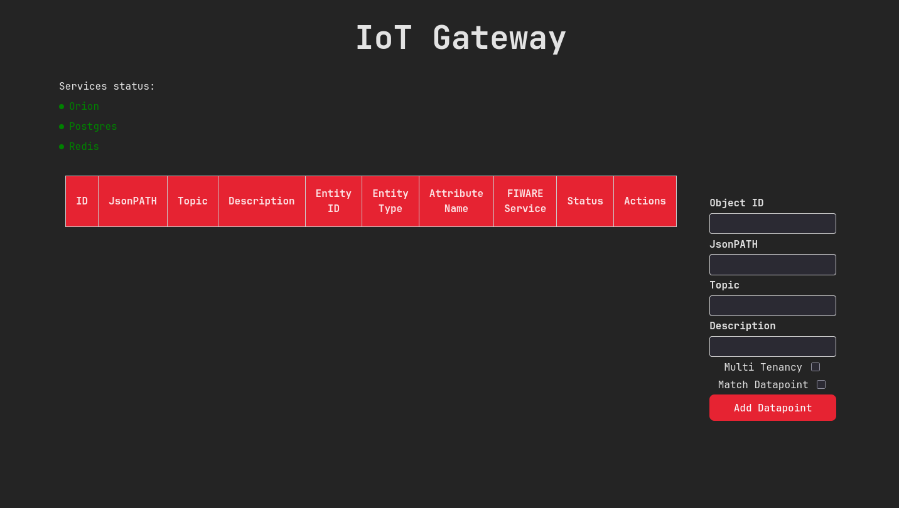
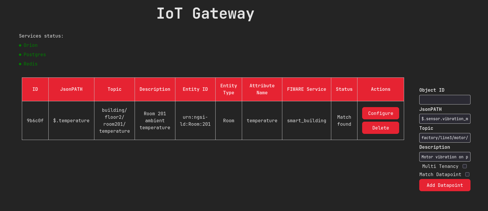
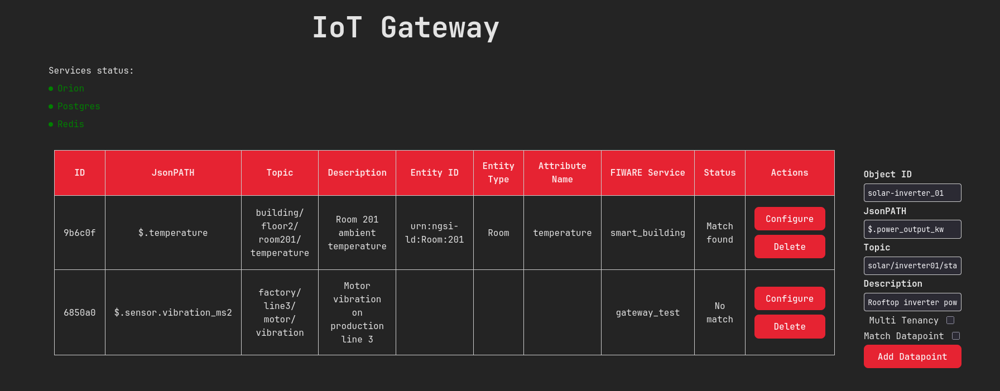
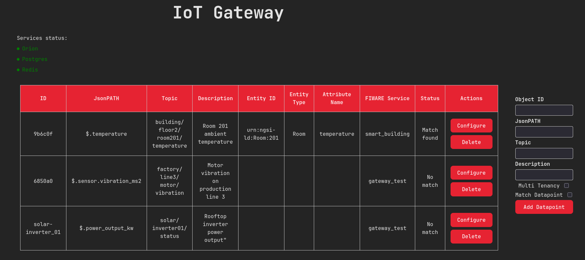
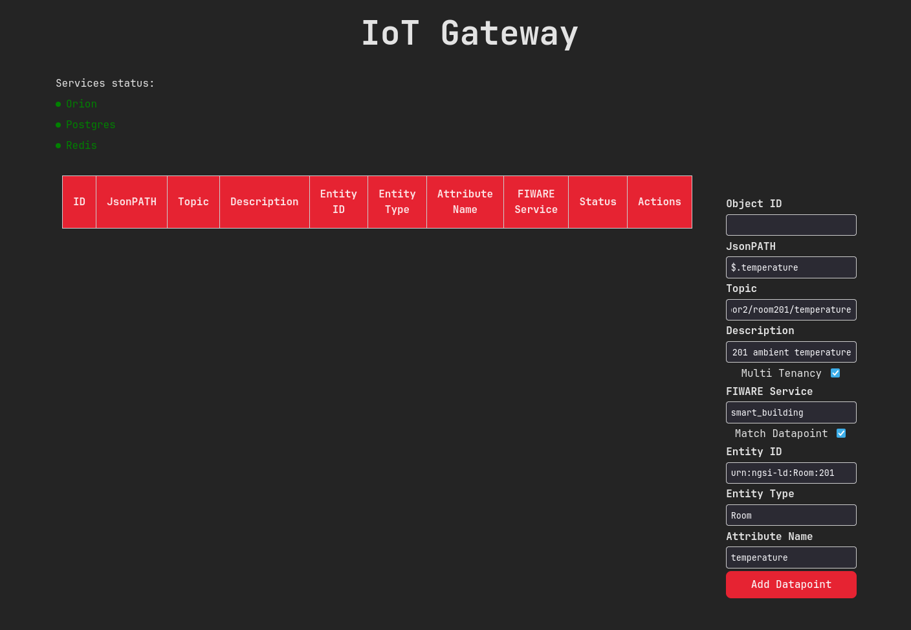
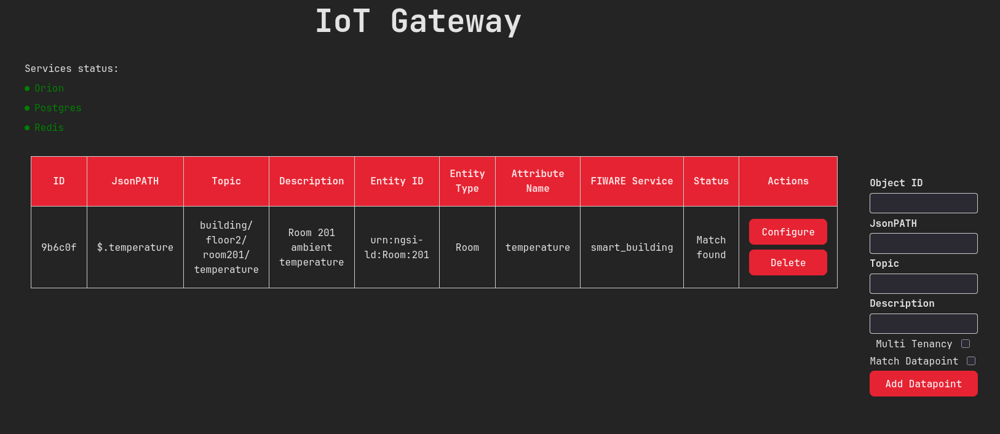
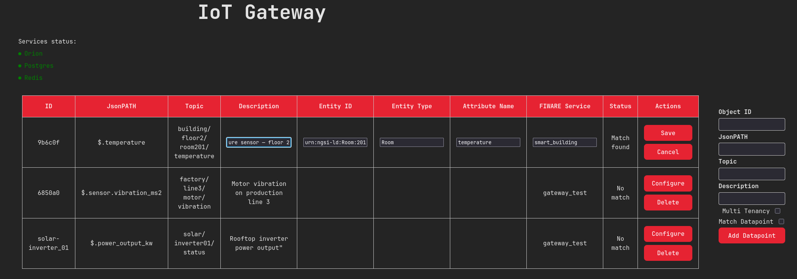
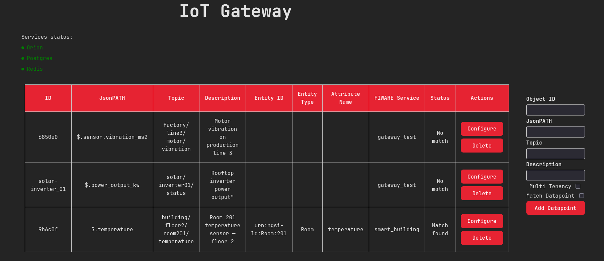
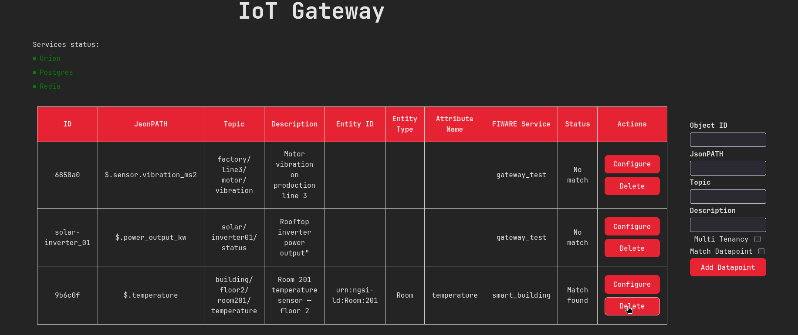
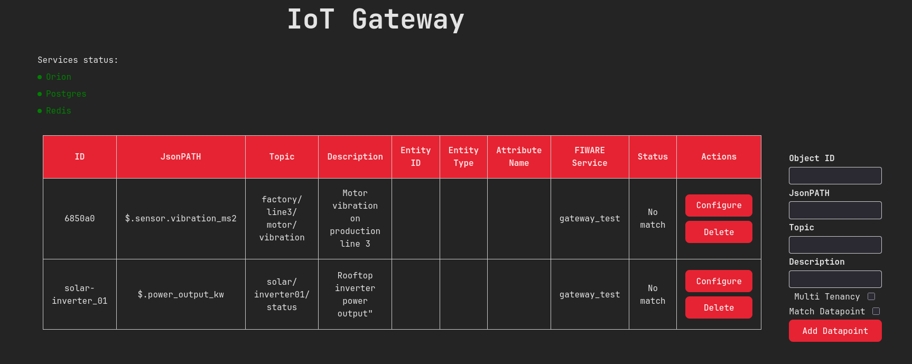

.. _usage:

===========
User Guide
===========

The MQTT Gateway is a universal southbound interface for the NGSI-V2 Context Broker (e.g. FIWARE-Orion).
It ingests MQTT data using JSON payloads, extracts values via **JsonPath** expressions, and forwards them
to the Context Broker. This guide covers configuration, API usage, and the Web UI.

.. contents:: Table of Contents
   :local:
   :depth: 2

----------

=============
Configuration
=============

The gateway is configured entirely through environment variables. These are read from a ``.env`` file
in the project root when running with Docker Compose, or exported directly in shell environments.

Create your ``.env`` from the provided template:

.. code-block:: bash

   cp .env.EXAMPLE .env
   # Edit .env with your values

Required Parameters
-------------------

.. list-table::
   :header-rows: 1
   :widths: 25 15 45 15

   * - Variable
     - Default
     - Description
     - Required
   * - ``ORION_URL``
     - ``http://orion:1026``
     - URL of the Orion Context Broker
     - Yes
   * - ``MQTT_HOST``
     - ``test.mosquitto.org``
     - Hostname of the MQTT broker
     - Yes
   * - ``MQTT_PORT``
     - ``1883``
     - Port of the MQTT broker
     - Yes
   * - ``MQTT_USER``
     - *(none)*
     - MQTT broker username. Leave empty if no auth.
     - No
   * - ``MQTT_PASSWORD``
     - *(none)*
     - MQTT broker password. Leave empty if no auth.
     - No
   * - ``MQTT_TLS``
     - ``false``
     - Enable TLS for MQTT connections
     - No
   * - ``POSTGRES_HOST``
     - ``localhost``
     - PostgreSQL database hostname
     - Yes
   * - ``POSTGRES_USER``
     - ``admin``
     - PostgreSQL username
     - Yes
   * - ``POSTGRES_PASSWORD``
     - ``postgres``
     - PostgreSQL password
     - Yes
   * - ``POSTGRES_DB``
     - ``iot_devices``
     - PostgreSQL database name
     - Yes
   * - ``REDIS_URL``
     - ``redis://localhost:6379``
     - Redis connection URL (used for caching and inter-process notifications)
     - Yes
   * - ``FIWARE_SERVICE``
     - ``gateway_test``
     - Default FIWARE service header sent to Orion
     - Yes
   * - ``FIWARE_SERVICEPATH``
     - ``/``
     - Default FIWARE service path header
     - Yes
   * - ``VITE_API_URL``
     - *(none)*
     - API URL for the frontend to connect to (e.g. ``http://localhost:8000``)
     - Yes

Optional Auth Parameters
------------------------

Set ``AUTH_ENABLED=true`` and configure these when your Orion instance requires
authentication (Keycloak / OAuth2):

.. list-table::
   :header-rows: 1
   :widths: 25 45 15

   * - Variable
     - Description
     - Required
   * - ``AUTH_ENABLED``
     - Enable OAuth2 authentication for Orion access
     - No (default: ``false``)
   * - ``AUTH_CLIENT_ID``
     - OAuth2 client ID
     - If ``AUTH_ENABLED=true``
   * - ``AUTH_CLIENT_SECRET``
     - OAuth2 client secret
     - If ``AUTH_ENABLED=true``
   * - ``AUTH_SERVER_URL``
     - Auth server base URL (e.g. Keycloak)
     - If ``AUTH_ENABLED=true``
   * - ``AUTH_REALM``
     - Auth server realm
     - If ``AUTH_ENABLED=true``

Logging
-------

.. list-table::
   :header-rows: 1
   :widths: 25 15 45

   * - Variable
     - Default
     - Description
   * - ``LOG_LEVEL``
     - ``INFO``
     - Log level: ``DEBUG``, ``INFO``, ``WARNING``, ``ERROR``, ``CRITICAL``

----------

===================
API Endpoints
===================

The REST API runs on FastAPI and provides full CRUD operations for datapoints plus system health checks.
All endpoints are documented interactively at ``/docs`` (Swagger UI).

Datapoint Model
---------------

Every datapoint has these fields:

.. list-table::
   :header-rows: 1
   :widths: 20 15 65

   * - Field
     - Type
     - Description
   * - ``object_id``
     - string (optional)
     - Unique identifier. Auto-generated (6-char UUID) if not provided.
   * - ``jsonpath``
     - string
     - JsonPath expression to extract the value from the MQTT payload
   * - ``topic``
     - string
     - MQTT topic to subscribe to
   * - ``entity_id``
     - string (optional)
     - Target entity ID in the Orion Context Broker
   * - ``entity_type``
     - string (optional)
     - Target entity type in the Orion Context Broker
   * - ``attribute_name``
     - string (optional)
     - Target attribute name in the Orion Context Broker
   * - ``description``
     - string (optional)
     - Human-readable description
   * - ``connected``
     - boolean (read-only)
     - Whether the datapoint is matched to an existing Orion entity/attribute
   * - ``fiware_service``
     - string (optional)
     - Per-datapoint FIWARE service override (multi-tenancy)

Endpoint Reference
------------------

**GET /data** — List or filter datapoints

   Query parameters (all optional — combine freely):

   - ``object_id`` — filter by object ID
   - ``topic`` — filter by MQTT topic
   - ``jsonpath`` — filter by JsonPath
   - ``entity_id`` — filter by entity ID
   - ``entity_type`` — filter by entity type
   - ``attribute_name`` — filter by attribute name

   .. code-block:: bash

      curl http://localhost:8000/data
      curl "http://localhost:8000/data?topic=sensors%2Ftemperature"

   Returns: ``200`` with list of ``Datapoint`` objects.

**GET /data/{object_id}** — Get a single datapoint

   .. code-block:: bash

      curl http://localhost:8000/data/abc123

   Returns: ``200`` with the ``Datapoint``, or ``404`` if not found.

**POST /data** — Create a new datapoint

   .. code-block:: bash

      curl -X POST http://localhost:8000/data \
        -H "Content-Type: application/json" \
        -H "FIWARE-SERVICE: myService" \
        -d '{
          "topic": "sensors/temperature",
          "jsonpath": "$.value",
          "entity_id": "Sensor001",
          "entity_type": "TemperatureSensor",
          "attribute_name": "temperature"
        }'

   Behavior depends on the fields provided — see the GUI section below for each creation mode.

   Returns: ``201`` with the created ``Datapoint``.
   Errors: ``400`` (validation), ``409`` (duplicate object_id).

**PUT /data/{object_id}** — Fully replace a datapoint's entity mapping

   Requires ``entity_id``, ``entity_type``, and ``attribute_name``. Cannot change
   ``topic`` or ``jsonpath`` (returns ``422``).

   .. code-block:: bash

      curl -X PUT http://localhost:8000/data/abc123 \
        -H "Content-Type: application/json" \
        -d '{
          "jsonpath": "$.value",
          "topic": "sensors/temperature",
          "entity_id": "Sensor002",
          "entity_type": "TemperatureSensor",
          "attribute_name": "temperature"
        }'

   Returns: ``200`` with the updated ``Datapoint``.

**PATCH /data/{object_id}** — Partially update a datapoint

   Allows updating only the fields you provide. Use this for editing specific
   fields without needing to send the entire object.

   .. code-block:: bash

      curl -X PATCH http://localhost:8000/data/abc123 \
        -H "Content-Type: application/json" \
        -d '{
          "entity_id": "NewSensor",
          "description": "Updated sensor"
        }'

   Returns: ``200`` with the updated ``Datapoint``.
   Errors: ``404`` (not found), ``400`` (entity_id without attribute_name or vice versa).

**DELETE /data/{object_id}** — Delete a single datapoint

   If this was the last datapoint on its topic, the gateway automatically
   unsubscribes from that MQTT topic.

   .. code-block:: bash

      curl -X DELETE http://localhost:8000/data/abc123

   Returns: ``204`` No Content.

**DELETE /data** — Delete all datapoints

   Unsubscribes from all topics and clears the database.

   .. code-block:: bash

      curl -X DELETE http://localhost:8000/data

   Returns: ``204`` No Content.

**GET /data/{object_id}/status** — Check match status

   Queries the Orion Context Broker to verify that the datapoint's ``entity_id``,
   ``entity_type``, and ``attribute_name`` actually exist.

   .. code-block:: bash

      curl http://localhost:8000/data/abc123/status

   Returns: ``200`` with ``true`` or ``false``.

System Endpoints
----------------

**GET /system/status** — Health check for all backend services

   .. code-block:: bash

      curl http://localhost:8000/system/status

   Response:

   .. code-block:: json

      {
        "overall_status": "healthy",
        "checks": {
          "orion":    { "status": true,  "latency": 12.3, "latency_unit": "ms", "message": null },
          "postgres": { "status": true,  "latency": 1.2,  "latency_unit": "ms", "message": null },
          "redis":    { "status": true,  "latency": 0.8,  "latency_unit": "ms", "message": null }
        }
      }

   ``overall_status`` is ``"healthy"`` only when all three checks pass.

**GET /system/version** — Version info for app and dependencies

   .. code-block:: bash

      curl http://localhost:8000/system/version

   Returns application version and versions of FastAPI, aiohttp, asyncpg, Pydantic, redis, and uvicorn.

----------

===================
GUI Instructions
===================

The Web UI is built with Svelte 5 and TypeScript. It has two main areas:

- **Left panel** — a table showing all registered datapoints with their status
- **Right panel** — a form for adding new datapoints
- **Top bar** — system health indicators (Orion, Postgres, Redis)

   The IoT Gateway web interface on first load — empty table and form ready for input.

Health Check
------------

The status bar at the top of the page shows three colored dots, one for each backend service:

- |green| **Green** — the service responded successfully
- |red| **Red** — the service is unreachable or returned an error
- **"Checking..."** — the status is still being fetched (shown briefly on page load)

Each check measures actual **latency** (in milliseconds). The checks are:

1. **Orion** — sends ``GET /version`` to the Orion Context Broker
2. **Postgres** — executes ``SELECT 1`` on the database
3. **Redis** — sends a ``PING`` command

If all three are green, the system is considered healthy.

.. |green| unicode:: U+1F7E2
.. |red|   unicode:: U+1F534

Creating Datapoints
-------------------

The form on the right supports several creation modes depending on which fields you fill:

Mode 1: Create DP with Generated Object ID
~~~~~~~~~~~~~~~~~~~~~~~~~~~~~~~~~~~~~~~~~~

#. Leave the **Object ID** field **empty**
#. Fill in the required fields: **JsonPATH** and **Topic**
#. Optionally add a **Description**
#. Click **"Add Datapoint"**

The API auto-generates a random 6-character object ID. The gateway subscribes
to the MQTT topic and the DP appears in the table.

   Mode 1: Form filled with JsonPATH and Topic, Object ID left empty.

   Mode 1 result: the new datapoint with auto-generated ID appears at the bottom of the table.

Mode 2: Create DP with Custom Object ID
~~~~~~~~~~~~~~~~~~~~~~~~~~~~~~~~~~~~~~~

#. Enter your own **Object ID** (letters, numbers, ``_``, ``-``, ``:``)
#. Fill in **JsonPATH** and **Topic**
#. Click **"Add Datapoint"**

If the object_id already exists, you'll get a ``409`` error.

   Mode 2: Custom Object ID ``solar-inverter_01`` entered alongside JsonPATH and Topic.

   Mode 2 result: the custom-ID datapoint appears in the table alongside existing entries.

Mode 3: Create DP with Matching (Connected DP)
~~~~~~~~~~~~~~~~~~~~~~~~~~~~~~~~~~~~~~~~~~~~~~

#. Check the **"Match Datapoint"** checkbox
#. The **Entity ID**, **Entity Type**, and **Attribute Name** fields become enabled — fill all of them in to tell the gateway which Orion entity/attribute to forward data to
#. Click **"Add Datapoint"**

**Match logic**: After creation, the API performs a ``GET`` request to the Orion Context Broker:

   ``GET /v2/entities/{entity_id}/attrs/{attribute_name}?type={entity_type}``

If Orion returns ``200``, the entity/attribute pair exists and the datapoint is
marked as **connected** (``connected: true`` in the database, shown as **"Match found"**
in the table). If Orion returns anything else, it's marked as **"No match"**.

   Mode 3: "Match Datapoint" and "Multi Tenancy" checked, entity fields and FIWARE Service filled in.

   Mode 3 result: datapoint shows **Match found** — Orion confirmed the entity and attribute exist.

When a message arrives on the subscribed topic, the gateway:

1. Extracts the value using the JsonPath expression
2. Sends a ``PATCH`` to ``/v2/entities/{entity_id}/attrs?type={entity_type}&options=keyValues``
3. The attribute value is updated directly in Orion

Multi-Tenancy
~~~~~~~~~~~~~

Check the **"Multi Tenancy"** box to enable the **FIWARE Service** field. Enter a
service name to override the default ``FIWARE_SERVICE`` for this datapoint. This
determines which FIWARE tenant the data is forwarded to.

Updating an Existing Datapoint
------------------------------

#. In the table, click **"Configure"** on any row
#. The row switches to edit mode — fields become editable inline
#. Modify **Description**, **Entity ID**, **Entity Type**, **Attribute Name**, or **FIWARE Service**
   (but NOT JsonPATH or Topic)
#. Click **"Save"** to confirm, or **"Cancel"** to discard

   Configure mode: the row switches to inline edit — Description, Entity ID, Entity Type, Attribute Name, and FIWARE Service become editable.

   After saving: the updated description is reflected in the table and the match status is re-checked.

The frontend sends a ``PATCH /data/{object_id}`` with only the changed fields.
After saving, the match status is re-checked against Orion.

Deleting a Datapoint
--------------------

#. Click **"Delete"** on the row you want to remove
#. The DP is removed from the database and Redis cache
#. If no other datapoints share the same MQTT topic, the gateway unsubscribes from it

   Click **"Delete"** on the row you want to remove.

   After deletion: the datapoint is removed from the table and the gateway unsubscribes from its topic if no other datapoints share it.
