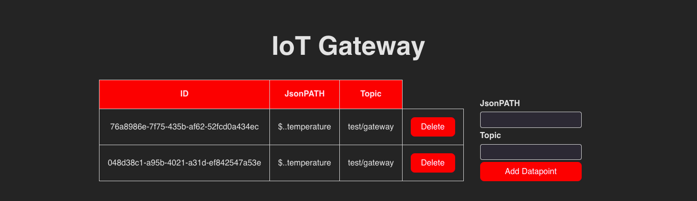

# Frontend for the IoT gateway

This is the frontend for the IoT gateway. It is a simple web application based on [Svelte](https://svelte.dev/) that allows to control the devices connected to the gateway. It is served by the python backend which also provides the REST API. 

Work in progress.

## Preview
